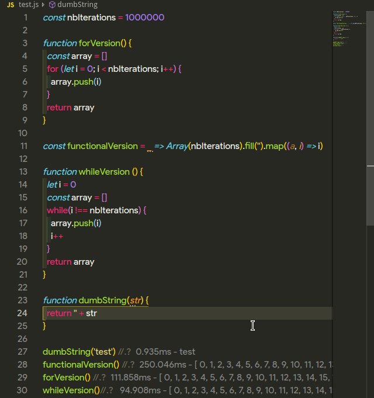

# akkouq

Fast prototyping.

## Features
Show variable value directly inside vscode

## Usage 
Type marker: //.? just after the variable to log its value and execution time

Each marker is launched sequentially to avoid any concurrency that could interfere with the execution time.
